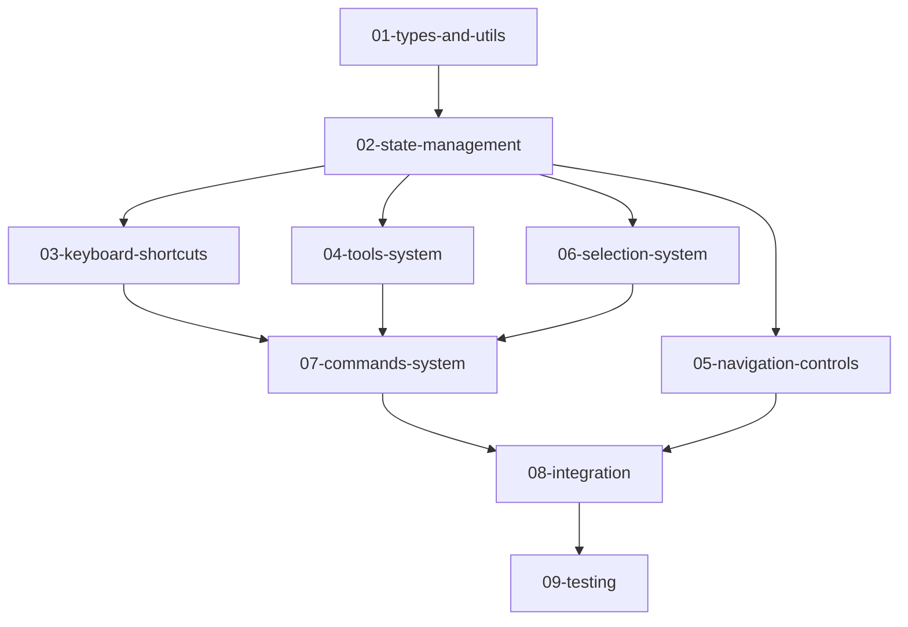

# 00 - 总体架构概览

## 系统架构设计

### 核心设计原则

1. **关注点分离** - 键盘、鼠标、工具、导航各自独立模块
2. **操作互不干扰** - 视图导航不影响工具状态,工具切换不影响选择
3. **可扩展性** - 新增工具或快捷键无需修改核心逻辑
4. **可测试性** - 每个模块可独立测试

### 架构层级

```
┌─────────────────────────────────────────────────────────────┐
│                        SceneView                            │
│  ┌───────────────────────────────────────────────────────┐  │
│  │               ViewportOverlay (UI Layer)              │  │
│  │  - 工具按钮                                           │  │
│  │  - 渲染模式切换                                       │  │
│  │  - 统计信息                                           │  │
│  └───────────────────────────────────────────────────────┘  │
│  ┌───────────────────────────────────────────────────────┐  │
│  │         KeyboardShortcutManager (DOM Layer)           │  │
│  │  - 监听全局键盘事件                                   │  │
│  │  - 分发到对应处理器                                   │  │
│  └───────────────────────────────────────────────────────┘  │
│  ┌───────────────────────────────────────────────────────┐  │
│  │            Canvas (R3F Layer)                         │  │
│  │  ┌─────────────────────────────────────────────────┐  │  │
│  │  │      EditorNavigationControls                   │  │  │
│  │  │  - Alt+鼠标旋转/缩放                            │  │  │
│  │  │  - 中键平移                                     │  │  │
│  │  └─────────────────────────────────────────────────┘  │  │
│  │  ┌─────────────────────────────────────────────────┐  │  │
│  │  │      FlyNavigationControls                      │  │  │
│  │  │  - 右键飞行模式                                 │  │  │
│  │  │  - WASD/QE 移动                                 │  │  │
│  │  └─────────────────────────────────────────────────┘  │  │
│  │  ┌─────────────────────────────────────────────────┐  │  │
│  │  │      ActiveToolGizmo                            │  │  │
│  │  │  - 根据 activeTool 渲染对应 Gizmo              │  │  │
│  │  └─────────────────────────────────────────────────┘  │  │
│  │  ┌─────────────────────────────────────────────────┐  │  │
│  │  │      BoxSelector                                │  │  │
│  │  │  - 框选功能 (已存在,需增强)                    │  │  │
│  │  └─────────────────────────────────────────────────┘  │  │
│  │  ┌─────────────────────────────────────────────────┐  │  │
│  │  │      SceneContent                               │  │  │
│  │  │  - 渲染场景对象                                 │  │  │
│  │  └─────────────────────────────────────────────────┘  │  │
│  └───────────────────────────────────────────────────────┘  │
└─────────────────────────────────────────────────────────────┘

                           ↕
┌─────────────────────────────────────────────────────────────┐
│                    Zustand Store (State)                    │
│  ┌──────────────────┐  ┌──────────────────┐                 │
│  │   editorStore    │  │   sceneStore     │                 │
│  │  - activeTool    │  │  - scene.objects │                 │
│  │  - selectedIds   │  │  - addObject     │                 │
│  │  - cursorMode    │  │  - removeObject  │                 │
│  │  - modifiers     │  │  - updateTransform                │
│  └──────────────────┘  └──────────────────┘                 │
│  ┌──────────────────┐                                       │
│  │  historyStore    │                                       │
│  │  - undo/redo     │                                       │
│  └──────────────────┘                                       │
└─────────────────────────────────────────────────────────────┘

                           ↕
┌─────────────────────────────────────────────────────────────┐
│                   Command System (Logic)                    │
│  - DuplicateCommand                                         │
│  - DeleteCommand                                            │
│  - TransformCommand                                         │
│  - ResetTransformCommand                                    │
└─────────────────────────────────────────────────────────────┘
```

### 数据流设计

#### 键盘事件流
```
用户按键
  ↓
KeyboardShortcutManager 捕获事件
  ↓
检查上下文 (输入框聚焦? 有选中对象?)
  ↓
查找快捷键注册表
  ↓
按优先级执行对应 Action
  ↓
更新 editorStore 状态
  ↓
React 组件响应状态变化
```

#### 鼠标事件流
```
用户鼠标操作
  ↓
检测修饰键 (Alt/Ctrl/Shift)
  ↓
判断事件类型:
  - Alt+左键 → EditorNavigationControls (旋转)
  - 中键拖动 → EditorNavigationControls (平移)
  - 右键按住 → FlyNavigationControls (飞行)
  - 左键点击 → 选择/Gizmo 交互
  ↓
更新对应状态
  ↓
视图/对象响应变化
```

#### 工具切换流程
```
快捷键 (Q/W/E/R/Y) 或 UI 点击
  ↓
editorStore.setActiveTool(toolName)
  ↓
前一个工具.onDeactivate()
  ↓
新工具.onActivate()
  ↓
ActiveToolGizmo 组件重新渲染
  ↓
显示对应工具的 Gizmo
```

---

## 技术栈说明

### 核心依赖

| 库 | 版本 | 用途 |
|----|------|------|
| React | ^19.x | UI 框架 |
| TypeScript | ^5.9 | 类型安全 |
| @react-three/fiber | ^9.x | Three.js React 封装 |
| @react-three/drei | ^10.x | R3F 辅助组件 (TransformControls 等) |
| three | ^0.x | 3D 渲染引擎 |
| zustand | ^5.x | 状态管理 |
| vitest | ^4.x | 测试框架 |

### 工具库选择

**为什么不使用额外的快捷键库?**
- 原生实现保证完全控制
- 减少依赖体积
- 更好的 TypeScript 类型支持

**为什么选择 Drei 的 TransformControls?**
- 已包含在项目依赖中
- 成熟稳定,符合 Unity 风格
- 支持自定义样式

---

## 实现阶段划分

### 第一阶段:基础设施 (2-3天)

**目标:** 搭建核心基础架构,无 UI 表现

**内容:**
- 类型定义 (快捷键、工具、命令)
- 平台检测工具
- editorStore 扩展
- 快捷键注册表
- KeyboardShortcutManager 组件

**验收标准:**
- 按下 Q/W/E/R/Y 可切换 activeTool 状态
- 修饰键状态正确更新
- 单元测试覆盖 > 80%

### 第二阶段:工具系统 (3-4天)

**目标:** 实现五种编辑工具及 Gizmo 交互

**内容:**
- 工具接口与基类
- HandTool / TranslateTool / RotateTool / ScaleTool / UniversalTool
- ActiveToolGizmo 组件
- Gizmo 交互逻辑

**验收标准:**
- 切换工具时 Gizmo 正确渲染
- 拖动 Gizmo 可修改对象 transform
- Shift 键加速功能正常
- 工具切换不影响选择状态

### 第三阶段:导航与选择 (2-3天)

**目标:** 增强视图导航与对象选择

**内容:**
- EditorNavigationControls (Alt+鼠标, 中键)
- FlyNavigationControls (右键飞行)
- 光标管理器 (箭头/抓手/眼睛)
- 多选增强 (Ctrl加选/Alt减选)
- 全选功能

**验收标准:**
- Alt+左键旋转视角不影响工具状态
- 右键飞行模式流畅,光标正确切换
- Ctrl+左键加选,Alt+左键减选
- Ctrl+A 全选所有对象

### 第四阶段:命令与集成 (2-3天)

**目标:** 实现命令系统,完成系统集成

**内容:**
- Command 接口
- CommandHistory (撤销/重做)
- DuplicateCommand / DeleteCommand / ResetTransformCommand
- 系统集成与优化
- E2E 测试

**验收标准:**
- Ctrl+D 复制对象
- Delete 删除对象(带确认)
- Ctrl+Z/Y 撤销/重做
- 完整工作流测试通过

---

## 依赖关系图



**实现建议:**
1. 严格按照依赖顺序实现
2. 每个模块完成后编写测试
3. 集成前确保单元测试全部通过

---

## 性能考虑

### 关键优化点

1. **键盘事件防抖**
   - 工具切换无需防抖 (即时响应)
   - 连续输入(如飞行移动)使用 requestAnimationFrame

2. **Gizmo 渲染优化**
   - 仅在有选中对象时渲染
   - 使用 Three.js InstancedMesh 优化多对象场景

3. **事件监听器管理**
   - 使用单一全局监听器,避免多个组件重复监听
   - 组件卸载时正确清理

4. **状态更新批处理**
   - 使用 Zustand 的 immer 中间件保证不可变性
   - 拖动时合并 Command,避免撤销栈过大

---

## 风险与挑战

### 已识别风险

1. **Pointer Lock API 兼容性**
   - **风险:** 飞行模式需要 Pointer Lock,部分浏览器可能不支持
   - **缓解:** 提供降级方案,检测 API 可用性后再启用

2. **快捷键冲突**
   - **风险:** 与浏览器默认快捷键冲突(如 Ctrl+W 关闭标签)
   - **缓解:** 使用 `e.preventDefault()`,文档说明冲突情况

3. **Three.js 事件穿透**
   - **风险:** Gizmo 与场景对象的点击事件可能冲突
   - **缓解:** 使用 `e.stopPropagation()`,正确设置事件优先级

4. **性能问题**
   - **风险:** 大场景下频繁更新可能卡顿
   - **缓解:** 使用 requestAnimationFrame,拖动时节流更新

---

## 下一步

阅读 [01-types-and-utils.md](./01-types-and-utils.md) 开始实现类型定义与工具函数。
