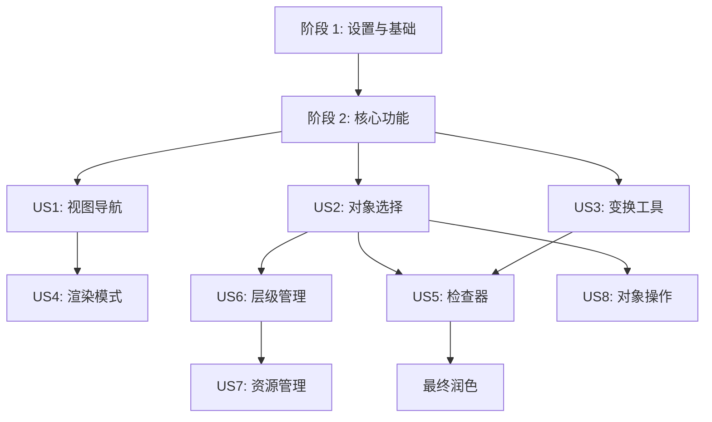

# 任务清单: 数字孪生三维场景编辑器

**分支**: `001-3d-scene-editor` | **规格**: [spec.md](./spec.md) | **计划**: [plan.md](./plan.md)

**注意**: 此任务清单基于功能规格和实施计划自动生成。
**状态**: 🔴 待开始

## 依赖关系图

## 执行阶段

### 阶段 1: 项目初始化 (Setup)

**目标**: 初始化项目结构，配置基础依赖和工具链。

- [x] T001 安装核心依赖 (three, @react-three/fiber, zustand, etc.) - `package.json`
- [x] T002 配置 Tailwind CSS 和基础样式 - `src/index.css`
- [x] T003 [P] 创建项目目录结构 (components, features, stores) - `src/`
- [x] T004 [P] 设置测试环境 (Vitest, React Testing Library) - `vite.config.ts`

### 阶段 2: 核心基础 (Foundational)

**目标**: 实现数据模型、状态管理和基础 UI 布局，为功能开发打下基础。
**阻塞**: 必须在开始任何用户故事之前完成。

- [x] T005 定义核心类型接口 (Scene, SceneObject, Transform) - `src/types/index.ts`
- [x] T006 [P] 实现 Zustand EditorStore (UI 状态) - `src/stores/editorStore.ts`
- [x] T007 [P] 实现 Zustand SceneStore (场景数据) - `src/stores/sceneStore.ts`
- [x] T008 [P] 实现主布局组件 (Header, Panels Layout) - `src/components/layout/MainLayout.tsx`
- [x] T009 实现基础 SceneView 组件 (Canvas, Lights, Grid) - `src/components/viewport/SceneView.tsx`

### 阶段 3: 用户故事 1 - 场景视图导航 (Priority: P1)

**目标**: 实现三维场景的自由导航（平移、旋转、缩放）。
**依赖**: T009
**独立测试**: 加载空场景，验证鼠标/键盘操作能否正确控制相机视角。

- [x] T010 [US1] 集成 OrbitControls 并配置基础导航 (旋转/缩放) - `src/features/editor/controls/EditorControls.tsx`
- [x] T011 [US1] 实现视图平移逻辑 (中键/Shift+左键) - `src/features/editor/controls/PanInput.ts`
- [x] T012 [US1] 实现飞行漫游模式 (Fly Mode) 逻辑 - `src/features/editor/controls/FlyControls.tsx`
- [x] T013 [US1] 实现视图聚焦 (Focus) 功能 (F 键) - `src/features/editor/controls/CameraActions.ts`
- [x] T014 [US1] [P] 添加视图坐标轴辅助器 (ViewGizmo) - `src/components/viewport/ViewGizmo.tsx`
- [x] T015 [US1] [TEST] 编写导航组件的单元测试 - `src/features/editor/controls/__tests__/EditorControls.test.tsx`
- [x] T049 [US1] 实现相机跟随/锁定功能 (FR-034/功能需求-034) - `src/features/editor/controls/CameraFollow.ts`

### 阶段 4: 用户故事 2 - 对象选择与层级同步 (Priority: P1)

**目标**: 实现对象的点击选择、框选，以及与 Hierarchy 面板的同步。
**依赖**: T007, T009
**独立测试**: 点击场景对象，Hierarchy 高亮；点击 Hierarchy 条目，场景对象高亮。

- [x] T016 [US2] 实现 SelectionManager (处理点击射线检测) - `src/features/interaction/SelectionManager.ts`
- [x] T017 [US2] [P] 实现 Hierarchy 组件 (树状列表) - `src/components/panels/Hierarchy.tsx`
- [x] T018 [US2] 实现选择同步逻辑 (Store 订阅) - `src/features/editor/hooks/useSelectionSync.ts`
- [x] T019 [US2] 实现框选功能 (Box Selection) - `src/features/interaction/BoxSelector.tsx`
- [x] T020 [US2] [TEST] 编写选择逻辑的集成测试 - `src/features/interaction/__tests__/Selection.test.tsx`

### 阶段 5: 用户故事 3 - 变换工具操作 (Priority: P1)

**目标**: 实现对象的移动、旋转、缩放编辑工具。
**依赖**: T016 (选择系统)
**独立测试**: 选中对象后出现 Gizmo，拖动 Gizmo 可修改对象 Transform 属性。

- [x] T021 [US3] 封装 TransformControls 组件 (集成 drei) - `src/features/editor/tools/TransformGizmo.tsx`
- [x] T022 [US3] 实现工具切换逻辑 (Q/W/E/R/Y 快捷键) - `src/features/editor/hooks/useToolShortcuts.ts`
- [x] T023 [US3] 实现变换数据回写 (Gizmo -> SceneStore) - `src/features/editor/tools/TransformLogic.ts`
- [x] T024 [US3] [P] 实现多选对象的中心点计算与变换 - `src/features/editor/utils/groupTransform.ts`

### 阶段 6: 用户故事 4 - 渲染模式切换 (Priority: P2)

**目标**: 支持线框、着色、混合模式的切换。
**依赖**: T009

- [x] T025 [US4] 实现渲染模式状态管理 - `src/stores/editorStore.ts` (update)
- [x] T026 [US4] 实现材质覆盖逻辑 (Material Override) - `src/features/editor/render/RenderModeManager.tsx`
- [x] T027 [US4] 添加 UI 切换按钮 - `src/components/layout/Toolbar.tsx`

### 阶段 7: 用户故事 5 - 检查器属性编辑 (Priority: P2)

**目标**: 在右侧面板显示并编辑选中对象的属性。
**依赖**: T016, T007

- [x] T028 [US5] 创建 Inspector 基础框架 - `src/components/panels/Inspector.tsx`
- [x] T029 [US5] [P] 实现 TransformProp 组件 (XYZ 输入框) - `src/components/inspector/TransformProp.tsx`
- [x] T030 [US5] [P] 实现 MaterialProp 组件 (材质参数) - `src/components/inspector/MaterialProp.tsx`
- [x] T031 [US5] 实现 DigitalTwinProp 组件 (模拟数据展示) - `src/components/inspector/TwinDataProp.tsx`
- [x] T032 [US5] 实现属性变更的双向绑定 - `src/features/editor/hooks/useObjectProps.ts`
- [x] T048 [US5] 实现数字孪生数据模拟生成器与WebSocket仿真 (FR-043/功能需求-043) - `src/features/twin/TwinDataService.ts`

### 阶段 8: 用户故事 6 - 层级树管理 (Priority: P2)

**目标**: 支持 Hierarchy 面板的拖拽重组。
**依赖**: T017

- [x] T033 [US6] 集成拖拽库 (dnd-kit 或原生 API) - `src/components/panels/hierarchy/DraggableItem.tsx`
- [x] T034 [US6] 实现重组逻辑 (Reparenting) - `src/stores/sceneStore.ts` (action)
- [x] T035 [US6] 处理循环引用检测 - `src/utils/sceneUtils.ts`

### 阶段 9: 用户故事 7 - 项目资源管理 (Priority: P3)

**目标**: 管理项目资源并支持拖拽实例化。
**依赖**: T007

- [x] T036 [US7] 创建 Project 组件 - `src/components/panels/Project.tsx`
- [x] T037 [US7] 实现 Mock 资源数据加载 - `src/features/assets/AssetLoader.ts`
- [x] T038 [US7] 实现资源拖拽到场景的逻辑 (Drag to Instantiate) - `src/features/interaction/DropManager.ts`

### 阶段 10: 用户故事 8 - 对象操作与撤销重做 (Priority: P3)

**目标**: 实现复制、删除以及全局撤销/重做。
**依赖**: T007, T006

- [x] T039 [US8] 实现 HistoryStore (命令栈) - `src/stores/historyStore.ts`
- [x] T040 [US8] 封装 Command 模式基类 - `src/features/commands/Command.ts`
- [x] T041 [US8] 实现具体命令 (TransformCommand, SelectionCommand, DeleteCommand) - `src/features/commands/impl/`
- [x] T042 [US8] 绑定快捷键 (Ctrl+Z/Y, Ctrl+D, Del) - `src/features/editor/hooks/useGlobalShortcuts.ts`

### 阶段 11: 最终润色与发布 (Polish)

**目标**: 性能优化、UI 细节调整、最终验收测试。

- [x] T043 实施 InstancedMesh 优化策略 (Ref: Research) - `src/features/performance/InstanceManager.tsx`
- [x] T044 添加性能监控面板 (Stats) - `src/components/viewport/PerformanceOverlay.tsx`
- [x] T045 最终 UI 样式调整 (Tailwind Theme) - `src/index.css`
- [x] T046 [TEST] 运行完整的端到端测试 (Playwright) - `tests/e2e/editor.spec.ts`
- [x] T047 [Polish] 实现场景导出为JSON功能 (FR-059/功能需求-059) - `src/features/scene/SceneExporter.ts`

## 实施策略

1. **MVP 优先**: 首先完成阶段 1-3，确保可以浏览场景。
2. **垂直切片**: 每个用户故事尽量包含从数据到 UI 的完整链路。
3. **测试驱动**: 对于复杂的逻辑（如撤销/重做、选择同步），先写单元测试。
4. **Mock 数据**: 早期开发完全依赖 Mock 数据，不等待后端。
